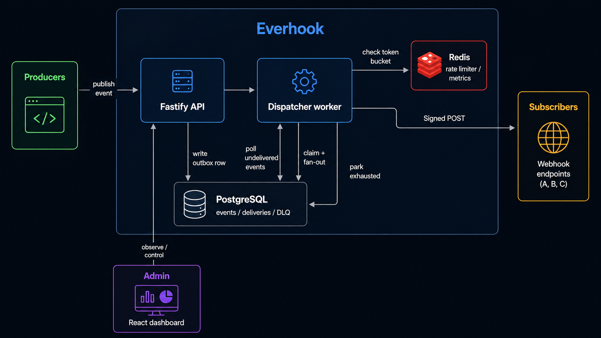
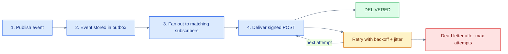
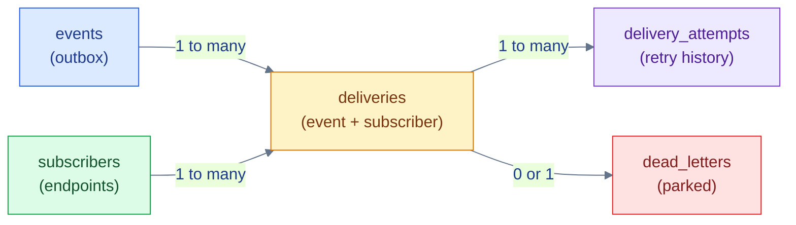
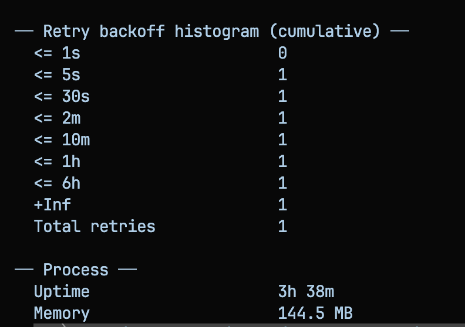
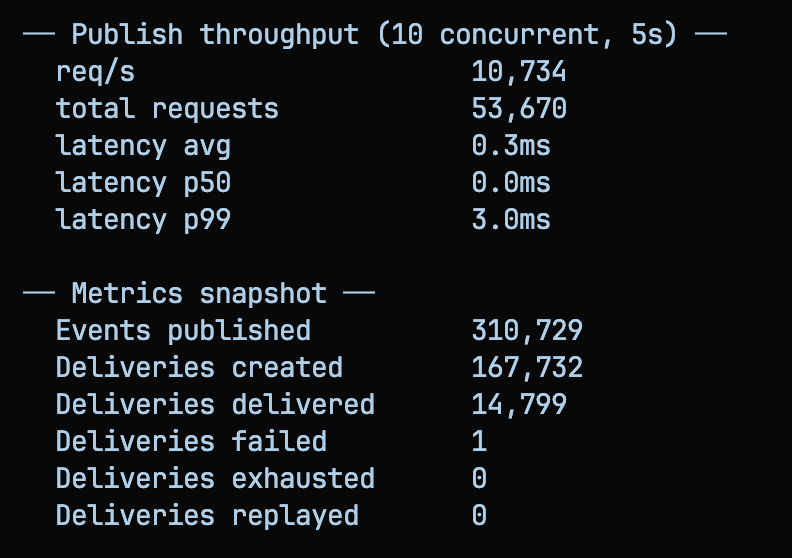

<div align="center">

# Everhook

**Publish once. Everhook delivers it to every matching webhook endpoint with retries, signing, rate limiting, and a dead letter queue.**

[](https://www.typescriptlang.org/)
[](https://fastify.dev/)
[](https://www.postgresql.org/)
[](https://redis.io/)
[](https://react.dev/)

</div>

---

## Contents

- **Introduction**
  - [What is Everhook?](#what-is-everhook)
  - [Why Everhook?](#why-everhook)
  - [Features](#features)
- **Architecture**
  - [System overview](#system-overview)
  - [Delivery lifecycle](#delivery-lifecycle)
  - [Data model](#data-model)
  - [Failure handling](#failure-handling)
  - [Reliability proofs](#reliability-proofs)
  - [Key design decisions](#key-design-decisions)
  - [Benchmark](#benchmark)
- **Getting Started**
  - [Quick start](#quick-start)
  - [Tech stack](#tech-stack)
  - [API surface](#api-surface)

---

## What is Everhook?

- Everhook is a self-hosted webhook delivery engine. You publish an event once, and Everhook fans it out to every matching subscriber endpoint with retries, secure signing, per-subscriber rate limiting, and a dead letter queue for exhausted deliveries.

- Naive webhook implementations fail in predictable ways:

    1. **Lost events** - the event is never durable before the API responds.
    2. **Duplicate deliveries** - a retry fires twice and the receiver double-processes.
    3. **Retry storms** - fixed-interval retries hammer a dead endpoint.

- Everhook solves these with a transactional outbox, idempotency keys, `X-Event-ID`, exponential backoff with jitter, and a Redis token bucket.

## Features

- **Transactional outbox** - events are committed to Postgres before the client gets an ack
- **At-least-once delivery** - no event is lost across worker crashes or restarts
- **Event-type fan-out** - one event delivers to every matching `ACTIVE` subscriber
- **Exponential backoff + jitter** - persisted as `next_retry_at`, no in-memory state
- **HMAC-SHA256 signing** - every delivery includes a per-subscriber signature
- **Per-subscriber rate limiting** - atomic Redis Lua token bucket
- **Dead letter queue + replay** - exhausted deliveries are parked, then replayed with a fresh budget
- **Attempt history** - every delivery records its full retry timeline
- **Prometheus metrics** - Redis-backed counters shared across processes
- **Live failure-injection demo** - break the subscriber, watch retries and DLQ react

---

## Architecture

### System overview



| Component | Role |
| --- | --- |
| Fastify API | Ingests events, manages subscribers, exposes delivery/dead-letter APIs and metrics |
| Dispatcher worker | Polls the outbox, fans out, delivers, retries, and sweeps the DLQ |
| PostgreSQL | Durable outbox plus delivery, attempt, and dead-letter state |
| Redis | Atomic per-subscriber token bucket and shared metrics |
| React dashboard | Live delivery view, dead-letter replay, and demo failure injection |

### Delivery lifecycle



The worker claims delivery rows with `FOR UPDATE SKIP LOCKED`, sends the payload with HMAC-SHA256 headers, and persists every outcome in Postgres. A 2xx marks the delivery `DELIVERED`. Failures increment `attempts` and schedule `next_retry_at` with exponential backoff. After `MAX_ATTEMPTS` (default 8), the delivery is parked in the DLQ; replay resets the attempt budget.

Every delivery includes:

| Header | Purpose |
| --- | --- |
| `X-Event-ID` | Lets the receiver dedupe retries |
| `X-Event-Type` | Event type delivered |
| `X-Delivery-Attempt` | Current attempt number |
| `X-Signature` | `sha256=HMAC(payload, subscriber_secret)` |

### Data model



| Table | Purpose | Key columns |
| --- | --- | --- |
| `events` | Durable outbox | `event_type`, `payload`, `idempotency_key` |
| `subscribers` | Registered endpoints | `url`, `event_types`, `status`, `secret` |
| `deliveries` | One row per event + subscriber | `status`, `attempts`, `next_retry_at`, `last_error` |
| `delivery_attempts` | Full retry timeline | `attempt`, `http_status`, `error`, `delivered` |
| `dead_letters` | Parked exhausted deliveries | `last_error`, `attempts`, `queued_at` |


### Failure handling

| Scenario | What Everhook does |
| --- | --- |
| Worker crashes mid-delivery | Transaction rolls back, the row stays `PENDING`, and the next poll re-claims it |
| Subscriber returns 5xx | Records the attempt and schedules `next_retry_at` with backoff + jitter |
| Subscriber hangs | `AbortSignal.timeout` (10s default) turns it into a retriable failure |
| Subscriber is down | Connection error follows the same retry path |
| Same event published twice | `idempotency_key` returns the existing `event_id` |
| Duplicate fan-out | `UNIQUE(event_id, subscriber_id)` prevents duplicate rows |
| Redis goes down | Rate limiter fails open; delivery continues with temporary overshoot |
| No matching subscriber | Event waits in the outbox, nothing is lost |

### Reliability proofs

The test suite injects real failures instead of only asserting happy paths.

| Test file | Proves |
| --- | --- |
| `events.test.ts` | Ingestion, validation, idempotent publish |
| `subscribers.test.ts` | Registration, generated secrets, validation |
| `pipeline.test.ts` | Fan-out, HMAC signing, retry, DLQ, replay |
| `failure-injection.test.ts` | Crash survival, hangs, subscriber down, batch restart |
| `demo.test.ts` | Demo setup idempotency, mock modes, reset |
| `metrics.test.ts` | Prometheus format, counters, retry histogram |

**27 tests across 6 files**, including simulated worker crashes, hanging subscribers, and full pipeline restarts with zero event loss.

### Key design decisions

- **Transactional outbox** - the event is committed to Postgres before the client gets an ack.
- **Database as the source of truth** - delivery state and retry schedules survive worker restarts.
- **`FOR UPDATE SKIP LOCKED`** - concurrent workers claim different rows instead of double-sending.
- **Backoff persisted as data** - `next_retry_at` is stored, not held in memory.
- **Redis Lua token bucket** - per-subscriber throttling is one atomic operation.
- **HMAC-SHA256 signing** - each subscriber has its own secret for signature verification.
- **DLQ with replay** - exhausted deliveries keep their error and attempt count, then replay resets the budget.

### Benchmark

<p align="center">
  
  
</p>

---


## Quick start

Requires Docker and Node.js 22+.

```bash
# 1. Start Postgres + Redis
docker compose up -d

# 2. Install dependencies
npm install

# 3. Server, worker, mock subscriber, and dashboard (four terminals)
cd server
cp .env.example .env
npm run dev            # API on :3000
npm run dev:worker     # delivery worker
npm run mock:subscriber

cd ../web
npm run dev            # UI on :5173

```


## Tech stack

| Layer | Technology | Why |
| --- | --- | --- |
| Language | TypeScript on Node 22+, ESM | Strict types end to end |
| HTTP API | Fastify 5 | Low overhead, schema-friendly |
| Database | PostgreSQL 16 + Drizzle ORM | Outbox, `SKIP LOCKED`, JSONB payloads |
| Rate limiter | Redis 7 + Lua script | Atomic token bucket shared across workers |
| Tests | Vitest | Fast ESM tests with `app.inject()` |
| Dashboard | React 19 + Vite | Live delivery feed and failure injection |
| Metrics | Prometheus text format | Redis-backed counters shared across processes |

## API surface

| Method | Path | Purpose |
| --- | --- | --- |
| `POST` | `/api/v1/events` | Publish an event |
| `GET` | `/api/v1/events` | List recent events |
| `POST` | `/api/v1/subscribers` | Register a webhook endpoint |
| `GET` | `/api/v1/subscribers` | List subscribers |
| `GET` | `/api/v1/deliveries` | Delivery status feed |
| `GET` | `/api/v1/deliveries/:id/attempts` | Attempt timeline for a delivery |
| `GET` | `/api/v1/stats` | Dashboard counters |
| `GET` | `/api/v1/dlq` | List dead letters |
| `POST` | `/api/v1/dlq/:id/replay` | Replay a dead letter |
| `GET` / `POST` | `/api/v1/demo/mock-mode` | Read / set mock subscriber health |
| `POST` | `/api/v1/demo/setup` | Idempotent demo setup |
| `POST` | `/api/v1/demo/reset` | Clear demo data |
| `GET` | `/health` | Uptime check |
| `GET` | `/metrics` | Prometheus metrics |
# Everhook

